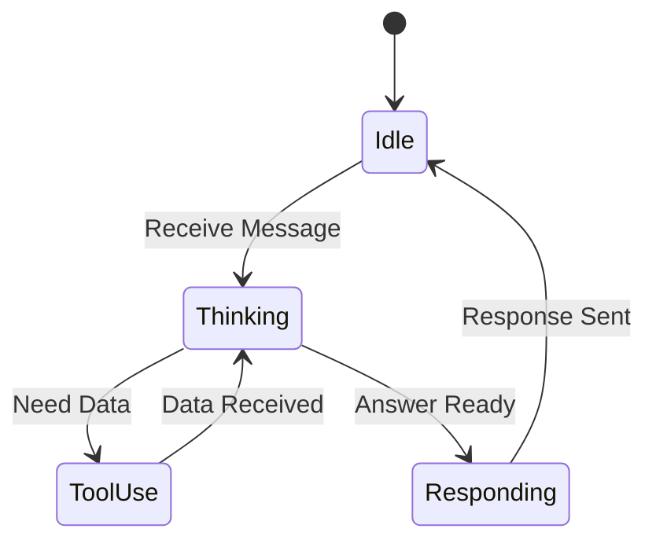

# Research: Exhaustive Specification Mapping Methodologies for AI Agents

This research outlines practical, actionable methodologies, tools, and formats for defining exhaustive specifications for AI agents. The focus is on techniques usable within a conversational interface between a human and an AI.

## 1. Established Methodologies
*Frameworks adapted for AI agent specification.*

### Requirements Engineering
*   **INVEST:** Ideal for defining "User Stories" for agent capabilities.
    *   **I**ndependent (Atomic skills)
    *   **N**egotiable (Refinable through dialogue)
    *   **V**aluable (Clear user benefit)
    *   **E**stimable (Agent can gauge complexity)
    *   **S**mall (Manageable context window usage)
    *   **T**estable (Verifiable output)
*   **MoSCoW:** Critical for prioritizing agent behaviors under constraint.
    *   **M**ust Have (Core logic/safety rails)
    *   **S**hould Have (Robust error handling)
    *   **C**ould Have (Nice-to-have personality traits)
    *   **W**on't Have (Out of scope/restricted actions)

### Behavioral & Formal Methods
*   **BDD (Behavior-Driven Development):** The "Lingua Franca" for AI agents.
    *   **Format:** `Given [Context] -> When [Trigger] -> Then [Action/Output]`
    *   **Why:** LLMs naturally understand and generate Gherkin syntax, making it perfect for defining prompt-response pairs.
*   **Lightweight Formal Methods:**
    *   **Design-by-Contract:** defining `pre-conditions` (what the agent needs) and `post-conditions` (what the agent guarantees) for every tool use.
    *   **State Analysis:** Simplified State Transition Tables to map how an agent moves between "Listening", "Processing", "Tool Use", and "Responding".

## 2. Tools & Utilities
*Lightweight, text-based tools usable in chat.*

| Category | Tool / Format | Usage for AI Agents |
| :--- | :--- | :--- |
| **Diagramming** | **Mermaid.js** | Agents can generate text that renders into flowcharts, sequence diagrams, and state diagrams to visualize logic flows. |
| **Modeling** | **PlantUML** | Similar to Mermaid but better for complex component architectures; text-based and easy to version control. |
| **Data Structure** | **JSON Schema** | The gold standard for specifying *tool inputs/outputs*. Defines exact structure, types, and validation rules. |
| **Configuration** | **YAML** | Best for defining agent personas, system prompts, and static configuration due to high readability. |
| **Documentation** | **Markdown Tables** | Excellent for Decision Matrices. An agent can read a Markdown table to understand "If X happens, do Y". |

## 3. Representation Formats
*Best formats for text-based specification.*

### Decision Matrices (Markdown Table)
Used for complex logic where multiple conditions dictate an outcome.
```markdown
| Input Type | Sentiment | User Role | Action |
| :--- | :--- | :--- | :--- |
| Bug Report | Angry | Customer | Escalate to Human + Apologize |
| Bug Report | Neutral | Customer | Auto-ticket + Thank |
| Feature | Positive | Admin | Log to Roadmap |
```

### State Transition Diagrams (Mermaid)
Visualizing the agent's lifecycle.


### Structured Use Case (Gherkin)
Defining a specific capability.
```gherkin
Feature: File Analysis
  Scenario: User uploads a CSV
    Given the user provides a file path ending in .csv
    And the file is less than 50MB
    When the agent reads the file
    Then it should print the first 5 rows as a markdown table
    And suggest 3 potential analysis questions
```

## 4. Completeness Criteria
*Metrics to verify the spec is "done".*

### Coverage Metrics
*   **Goal Coverage:** Does every stated user goal have at least one defined workflow?
*   **Branch Coverage:** Are positive (happy path) AND negative (error/refusal) paths defined for every decision point?
*   **State Coverage:** logic exists for every state (e.g., "What happens if the API is down?" "What if the user cancels?").

### Validation Checklists
*   [ ] **Ambiguity Check:** Are any terms subjective? (e.g., "fast", "friendly" - define them).
*   [ ] **Input Boundaries:** Are max lengths, file sizes, and forbidden characters defined?
*   [ ] **Failure Modes:** Is there a protocol for when the agent *cannot* fulfill a request?
*   [ ] **Tool Definitions:** Do all tools have explicit schemas and descriptions?

## 5. Lightweight Approaches for Real-Time Dialogue
*Techniques for on-the-fly specification with an agent.*

### Conversational Elicitation
*   **The 5 Whys:** When a requirement is vague, the agent asks "Why?" up to 5 times to drill down to the root constraint.
*   **Clarification Dialogues:** The agent reflects back its understanding: "So, you want me to X, but only if Y. Is that correct?"
*   **Role-Play Simulation:** "Let's pretend I am the agent. You say X. I reply Y. Does that meet your need?"

### Progressive Refinement Patterns
1.  **Brain dump:** User speaks loosely about the idea.
2.  **Structuring:** Agent converts the dump into a bulleted list or mind map.
3.  **Gap Analysis:** Agent highlights missing pieces (e.g., "You mentioned email, but didn't say which provider.").
4.  **Formalization:** Converting the refined list into a JSON Schema or Gherkin feature file.
5.  **Review:** Final sign-off on the structured artifact.