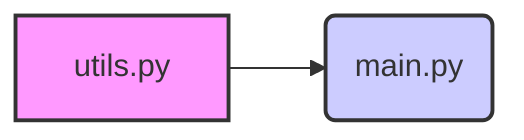

# Codebase Documentation

Generated: 2026-01-18 13:35:46
Directory: ./src
Files processed: 1

---

Okay, here's the system architecture document based on the provided file summary.  Since there's only one file provided, this is a very basic starting point and would be significantly expanded with more files. I will extrapolate reasonable dependencies for demonstration purposes.

## System Architecture Document: RSS Summarizer (Initial Version)

### 1. Module Overview: `utils.py`

*   **Primary Purpose:** Provides utility functions for general tasks, specifically formatting durations.
*   **Key Functions/Classes Exported:**
    *   `format_duration(seconds)`:  Formats a time duration in seconds into a human-readable string (e.g., "1 minute", "2 hours", "3 days").
*   **Dependencies:** None (assumed; might depend on standard library modules like `typing`).
*   **Modules Depending On It:** `main.py` and potentially other future modules.

### 2. System Map



**Explanation of the System Map:**

*   `utils.py` is represented as a module providing utility functions.
*   `main.py` (assumed to be the main execution point) depends on `utils.py` because it likely uses the `format_duration` function.  The arrow indicates this dependency.

### 3. Data Flow Diagram (Text-Based - Very Basic)

```
[Start] --> Main Processing in main.py
main.py calls utils.py: format_duration(seconds)
utils.py returns formatted duration string to main.py
main.py displays results or performs further actions with the formatted duration
--> [End]
```

**Explanation of Data Flow:** The diagram illustrates how data (specifically a `seconds` value and a resulting formatted string) flows from `main.py` through `utils.py` and back to `main.py`.  This would become more complex as more modules are added.

### 4. Entry Points

*   `main.py`: This is assumed to be the primary entry point, likely containing a `main()` function or similar that orchestrates the RSS summarization process. (Not visible in provided file summary)

### 5. Shared Utilities

*   `utils.py`:  This module inherently acts as a repository for shared utilities that could potentially be used by other modules in the future.
---

**Assumptions & Next Steps:**

*   **More Files Needed:** This is a very rudimentary architecture document based on *one* file summary. A complete picture requires summaries of all files.  Specifically, `main.py` is crucial for understanding the overall flow.
*   **Dependencies:** The dependencies listed are minimal. As more modules are analyzed, these will likely expand (e.g., network libraries, parsing libraries, etc.).
*   **Error Handling/Logging:** Not addressed in this initial document. Error handling and logging mechanisms would be important to specify as the system grows.
*   **Data Structures**: The structure of data being passed around hasn't been described. This could be added once more files are available.

To improve this further, please provide summaries for other modules (e.g., `main.py`, any parsing/downloading code, etc.).

---

# File-by-File Documentation
## ers\jpswi\personal projects\RSSsummarizer\src\utils.py

**Lines:** 46 | **Estimated tokens:** ~307

- Lines 1-1: global `module_docstring` - Module-level docstring describing purpose
- Lines 4-46: function `format_duration` - Formats seconds into human-readable duration; uses conditional logic to display in appropriate units (seconds, minutes, hours, days).

---


